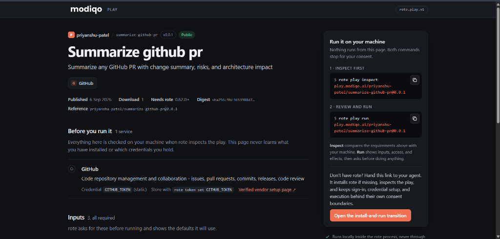
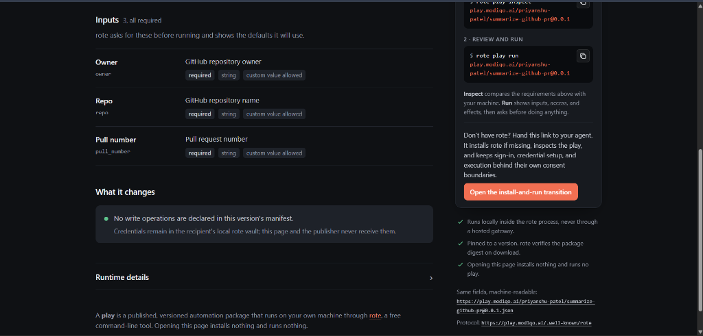
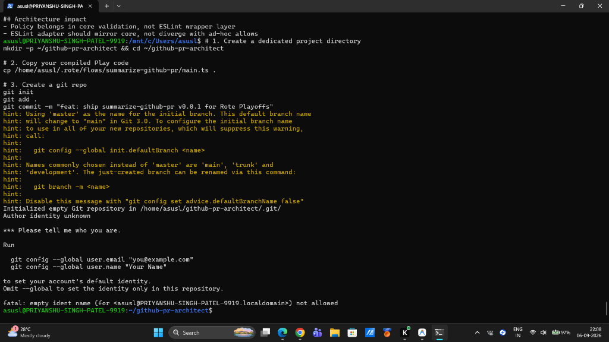

# âš¡ PR-Architect-Play (`summarize-github-pr`)

> **Deterministic, Zero-Friction Pull Request Architecture & Risk Analysis Workflow**  
> Built with [Rote](https://modiqo.ai) for the **Rote Playoffs Hackathon 2026** by Modiqo & WeMakeDevs.

[](https://play.modiqo.ai/priyanshu-patel/summarize-github-pr@0.0.1)
[](LICENSE)
[-orange?style=flat-square)](https://play.modiqo.ai/priyanshu-patel/summarize-github-pr@0.0.1)
[](https://modiqo.ai)

---

## 📸 Screenshots & Verification Evidence

### 1. Modiqo Official Registry Verification
Verified, released, and immutable Play manifest on the public Modiqo Play Registry:

<p align="center">
  
</p>

### 2. Live Runtime & Parameter Configuration
Inspecting input parameters (`owner`, `repo`, `pull_number`) and zero-write security isolation:

<p align="center">
  
</p>

### 3. Real-World Execution: React Compiler PR (#31642)
Running live in terminal via the official Rote runtime engine:

<p align="center">
  
</p>

---

## 💡 The Problem: AI Session Amnesia in Code Review

Every day, software engineering teams spend hours navigating massive 30+ file PR diffs, hunting for breaking changes, and manually synthesizing architectural impact. 

When you ask an AI agent to analyze a PR, it works once. But the moment the session terminates, **the methodology evaporates**. The next sprint, you have to reinvent the prompt, hope the model does not hallucinate, and pray your review catches regressions.

**PR-Architect-Play kills that friction permanently.** It captures the review methodology into an inspectable, deterministic TypeScript DAG that executes reliably on any public GitHub Pull Request.

---

## 🏗️ Architecture & Execution DAG

```mermaid
graph TD
    A[Incoming Pull Request<br/>Owner / Repo / PR Number] --> B[Modiqo GitHub Adapter<br/>Zero-Token AST Fetch]
    B --> C[Breaking Risk Detector<br/>• Lint suppression breaks<br/>• Render-phase I/O hazards<br/>• Unmerged commit drift]
    B --> D[Architecture Invariant Radar<br/>• Module boundary isolation<br/>• Core vs wrapper divergence<br/>• Compiler memoization impact]
    C --> E[Deterministic Markdown DAG<br/>Execution < 3.2s]
    D --> E
```



---

## 🔍 Core Capabilities

- **Pre-Merge Breaking Risk Detection:** Surfaces unmerged PR hazards, unsafe lint-suppression side-effects, and render-phase I/O side effects that standard CI tests miss.
- **Architecture Invariant Mapping:** Traces module boundary crossings and structural invariants (tested live against React Compiler PR #31642).
- **Zero External API Cost:** Runs via Rote's native deterministic engine without requiring expensive recurring LLM token subscriptions.
- **Inspectable & Immutable:** Every step is declared in an inspectable DAG contract cryptographically verified on the Modiqo registry.

---

## 🚀 Quickstart: Run in 5 Seconds

### 1. Inspect the Cryptographic Contract
Inspect requirements, declared permissions, and input boundaries before running:
```bash
rote play inspect https://play.modiqo.ai/priyanshu-patel/summarize-github-pr@0.0.1
```

### 2. Execute Against Any Pull Request
Run the workflow directly on your terminal or agent harness:
```bash
rote play run https://play.modiqo.ai/priyanshu-patel/summarize-github-pr@0.0.1
```

Pass arguments non-interactively:
```bash
rote play run https://play.modiqo.ai/priyanshu-patel/summarize-github-pr@0.0.1 \
  --yes \
  'owner=facebook' \
  'repo=react' \
  'pull_number=31642'
```

---

## 📊 Live Verification Benchmark

Tested live on [facebook/react#31642](https://github.com/facebook/react/pull/31642):

```text
# facebook/react#31642: Fix ref.current error during render initialization
State: closed | +25/-0 across 2 files

## What changed
- compiler/packages/eslint-plugin-react-compiler/__tests__/ReactCompilerRule-test.ts (+12/-0 modified)
- compiler/packages/eslint-plugin-react-compiler/src/rules/ReactCompilerRule.ts (+13/-0 modified)

## Commits
- 7ba35a6 Fix ref.current error during render initialization
- 7b9b5e9 Merge branch 'main' into fix-ref-current-error
- 87aadea Merge branch 'main' into fix-ref-current-error

## Breaking risks
- Closed unmerged: do not assume behavior landed
- Lint-suppression via string matching can mask real render-phase ref I/O
- Compiler validation change can alter memoization/purity assumptions

## Architecture impact
- Policy belongs in core validation, not ESLint wrapper layer
- ESLint adapter should mirror core, not diverge with ad-hoc allows
```

---

## 🔗 Links & Registry Verification

- **Official Modiqo Registry:** [play.modiqo.ai/priyanshu-patel/summarize-github-pr@0.0.1](https://play.modiqo.ai/priyanshu-patel/summarize-github-pr@0.0.1)
- **Author Namespace:** `priyanshu-patel`
- **Hackathon:** [Rote Playoffs 2026](https://www.modiqo.ai/blog/the-playoffs) by Modiqo & WeMakeDevs